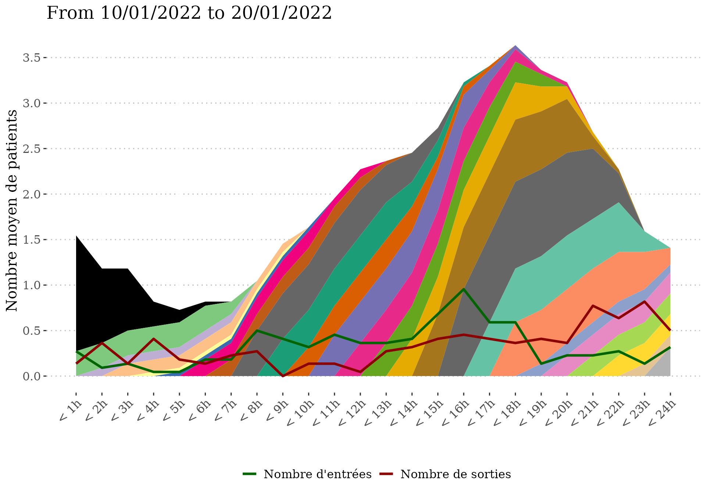
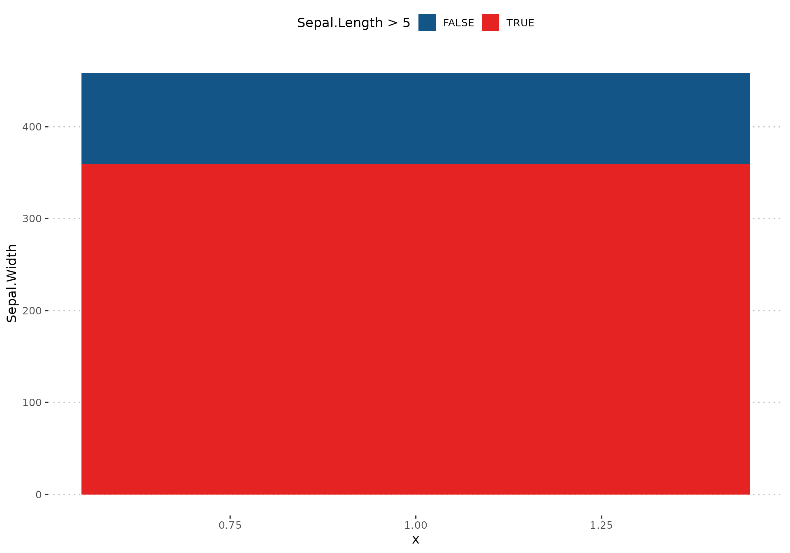

# Getting-started

``` r
library(rUrgAra)
```

## Exemple dataset

We will see in this vignette how rUrgAra can help in plotting charge
diagram and graphs following rUrgAra’s graphical chart.

## Plot a charge diagram

This exemple shows how to plot a charge diagram using rUrgAra’s
plot_diag_charge() from a table containing entry and exit date/times.

``` r
#Table of entry/exit times
head(df_ex_charge)
#> # A tibble: 6 × 3
#>   ENTREE              SORTIE              Etablissement
#>   <dttm>              <dttm>              <chr>        
#> 1 2022-01-16 16:14:00 2022-01-16 22:24:41 A            
#> 2 2022-01-04 16:12:00 2022-01-04 23:38:01 A            
#> 3 2022-01-12 14:18:00 2022-01-12 20:20:26 A            
#> 4 2022-01-24 08:25:00 2022-01-24 16:27:53 A            
#> 5 2022-01-03 19:08:00 2022-01-04 01:05:40 A            
#> 6 2022-01-31 16:09:00 2022-01-31 22:54:14 A
#Charge diagram with exclusion of patients staying more than 3 days (72*60 = 4320 minutes)
# not taking into account strata 
list_charge = plot_diag_charge(data = df_ex_charge, entry = "ENTREE",
                               exit = "SORTIE", max_LOS = 72*60)
#plot_diag_charge return two objects, a table showing for each hour of
# the day how many patient came from what hour (-1 = day before)
head(list_charge$tab)
#> # A tibble: 6 × 6
#>   H_entry  Hour     n n_strata n_days n_avg
#>     <dbl> <dbl> <int>    <dbl>  <dbl> <dbl>
#> 1      -1     1   115        1     32 3.59 
#> 2      -1     2    96        1     32 3    
#> 3      -1     3    76        1     32 2.38 
#> 4      -1     4    57        1     32 1.78 
#> 5      -1     5    33        1     32 1.03 
#> 6      -1     6    17        1     32 0.531
#a charge diagram
list_charge$plot
```


``` r

#adding a strata to take into account that data are coming from two hospitals
list_charge_stratified = plot_diag_charge(data = df_ex_charge, entry = "ENTREE",
                                          exit = "SORTIE", strata = "Etablissement",
                                          max_LOS = 72*60)
#plot_diag_charge return two objects, a table showing for each hour of
# the day how many patient came from what hour (-1 = day before)
head(list_charge_stratified$tab)
#> # A tibble: 6 × 6
#>   H_entry  Hour     n n_strata n_days n_avg
#>     <dbl> <dbl> <int>    <int>  <dbl> <dbl>
#> 1      -1     1   115        2     32 1.80 
#> 2      -1     2    96        2     32 1.5  
#> 3      -1     3    76        2     32 1.19 
#> 4      -1     4    57        2     32 0.891
#> 5      -1     5    33        2     32 0.516
#> 6      -1     6    17        2     32 0.266
#a charge diagram
list_charge_stratified$plot
```


``` r

#Limiting the charge diagram to a set period
list_charge_stratified = plot_diag_charge(data = df_ex_charge, entry = "ENTREE",
                                          exit = "SORTIE", strata = "Etablissement",
                                          from = "10/01/2022", to = "20/01/2022",
                                          max_LOS = 72*60)
#> Warning in plot_diag_charge(data = df_ex_charge, entry = "ENTREE", exit =
#> "SORTIE", : 326 rows were removed because they were outside of the studied
#> range.
list_charge_stratified$plot + 
  ggplot2::labs(title = "From 10/01/2022 to 20/01/2022")
```



``` r

#Hiding the number of entry/exit
list_charge_no_lines = plot_diag_charge(data = df_ex_charge, entry = "ENTREE",
                                          exit = "SORTIE", strata = "Etablissement",
                                          show_lines = FALSE)
list_charge_no_lines$plot
```


## Adding a company logo to a plot

This exemple shows how to add a company logo (by default UrgAra’s) to a
ggplot object.

``` r
plot_cars = ggplot2::ggplot(cars, ggplot2::aes(x = speed, y = dist)) +
  ggplot2::geom_point() +
  ggpubr::theme_pubclean()

plot_add_logo(plot_cars)#default
```


``` r
plot_add_logo(plot_cars, position = "top left")#logo at the top
```


``` r
plot_add_logo(plot_cars, width = 0.4)#wider logo
```


## Adding rUrgAra color palette

### Applying rUrgAra palette to a color scale

``` r
plot_iris = ggplot2::ggplot(iris, ggplot2::aes(x = Sepal.Length, y =  Sepal.Width, color = Species)) +
  ggplot2::geom_point(size = 1.5)

plot_iris#default
```


``` r

plot_iris +
  ggplot2::scale_color_manual(values = pal_UrgAra()) +#Urg'Ara's color palette
  ggpubr::theme_pubclean() +
  ggplot2::theme(legend.key = ggplot2::element_blank())
```


### Applying rUrgAra palette to a fill scale

``` r
plot_iris_bar = ggplot2::ggplot(iris, ggplot2::aes(x = Sepal.Length, y =  Sepal.Width, fill = Species)) +
  ggplot2::geom_col()

plot_iris_bar#default
```


``` r

plot_iris_bar +
  ggplot2::scale_fill_manual(values = pal_UrgAra()) +#Urg'Ara's color palette
  ggpubr::theme_pubclean()
```


### Applying rUrgAra palette to a dichotomous variable

``` r
plot_iris_dicho = ggplot2::ggplot(iris, ggplot2::aes(x = 1, y =  Sepal.Width, fill = Sepal.Length > 5)) +
  ggplot2::geom_col()

plot_iris_dicho#default
```


``` r

plot_iris_dicho +
  ggplot2::scale_fill_manual(values = pal_UrgAra(palette = "duo")) +#Urg'Ara's color palette
  ggpubr::theme_pubclean()
```



### Importing templates from rUrgAra

You can import a template from rUrgAra using get_template

``` r
get_template(template_name = "report", folder = "src/")
```
